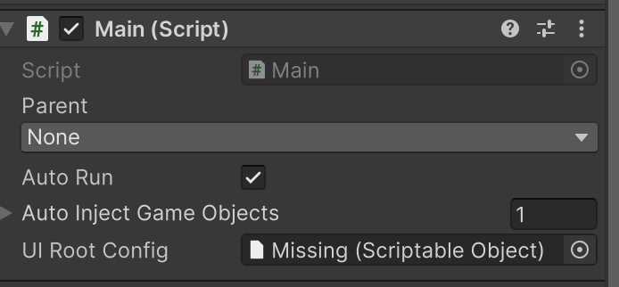
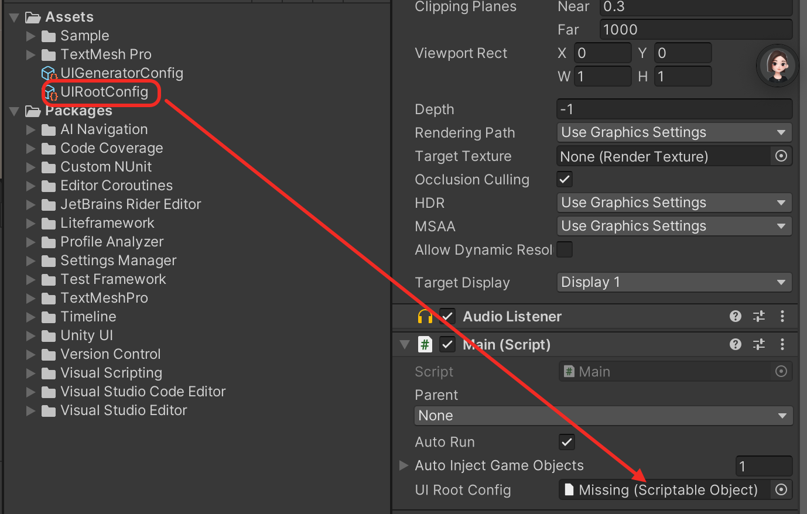

# 🚀 LiteFramework 快速上手指南（QuickStart）

---

## 🛠️ 第一步：安装框架（推荐方式：UPM）

1. 打开你的 Unity 项目，添加 `LiteFramework` 的 Git 依赖：

   编辑 `Packages/manifest.json`：

   ```json
   {
     "dependencies": {
       "com.liteframework.unity": "https://github.com/FireHappy/LiteFramework.git?path=Packages/LiteFramework"
     }
   }
   ```

2. 或者使用 Unity 的 UPM UI 手动添加 Git URL：  
   `https://github.com/FireHappy/LiteFramework.git`

3. 确保以下依赖存在：  
   - ✅ TextMeshPro（推荐）  
   - ✅ 使用 `Resources` 作为 UI 加载路径（默认读取 `Resources/UI/`，可通过 UIRootConfig 配置）

---

## 🧩 第二步：配置自动生成规则

1. 在 Unity 中右键创建配置文件：  
   `Create > LiteFramework > UI Generator Config`

2. 可选配置项：
   - 修改默认命名空间
   - 修改脚本输出路径

3. 配置命名前缀与组件类型映射,例如

   | 前缀_功能名     | 映射组件类型                | 生成后的字段     |
   |----------------|-----------------------------|------------------|
   | `Btn_Login`    | `UnityEngine.UI.Button`     | `btnLogin`       |
   | `Txt_UserName` | `TMPro.TextMeshProUGUI`     | `txtUserName`    |
   | `Img_Head`     | `UnityEngine.UI.Image`      | `imgHead`        |

---

## 📦 第三步：创建 UI 预制体

1. 在路径 `Assets/Resources/UI/` 下新建预制体，例如：`TestView.prefab`  
   ⚠️ 注意：预制体必须以 `View` 结尾命名，确保生成的 UI 脚本与预制体名一致，方便 UIManager 使用 View 类名加载对应的 ViewPrefab。

2. 为子组件命名（需符合配置前缀）：
   - `Btn_Confirm`
   - `Txt_Title`

3. 保存并返回 Unity 编辑器。

---

## ⚙️ 第四步：生成脚本

1. 选中 `TestView.prefab`  
2. 右键点击：  
   `LiteFramework > Generate UI MVP Template`

3. 自动生成以下文件：
   - `TestView.cs`
   - `TestView.Auto.cs`
   - `TestPresenter.cs`

---

## 🧠 第五步：编写业务逻辑

在 `TestPresenter.cs` 中编写逻辑：

```csharp
public override void OnViewReady()
{
   View.Btn_Confirm.onClick.AddListener(OnConfirmClicked);
}

private void OnConfirmClicked()
{
   Debug.Log("点击了确认");
}
```

---

## 🚀 第六步：基于 VContainer 的启动类

```csharp
public class Main : LiteStartupBase
{
   protected override Assembly[] GetCustomAutoRegisterAssemblies()
   {
       return new[]
       {
           // 添加 TestPresenter 所在的程序集
           typeof(TestPresenter).Assembly
       };
   }

   protected override void OnRegisterCustomServices(IContainerBuilder builder)
   {
       // todo 注册自定义服务
   }

   protected override void OnStart()
   {
       // 使用 VContainer 容器获取 ui 路由
       var router = Container.Resolve<UIRouter>();
       router.Open<TestView>();
   }
}
```

将以上脚本挂在场景相机上，或根节点的 GameObject 上。  


---

## 🪛 第七步：配置 UIRoot

1. 在 Unity 中右键创建配置文件：  
   `Create > LiteFramework > UI Root Config`

2. 可选配置项：
   - UI 加载路径
   - 默认 UITag
   - 默认 DialogTag
   - UIRoot 预制体 

3. 将 UIRootConfig 拖拽到 Main 脚本的 UIRootConfig 属性上  
   

---

## 📌 常见问题排查

| 问题                  | 解决方法                                                   |
|-----------------------|------------------------------------------------------------|
| ❌ 生成字段不成功      | 检查组件命名是否符合前缀；检查配置映射是否正确             |
| ❌ 加载路径错误        | 确保资源放置在 `Resources/UI/` 路径下                     |
| ❌ 脚本未正确绑定      | 确保生成后未手动修改类名，且未打断自动绑定机制             |
